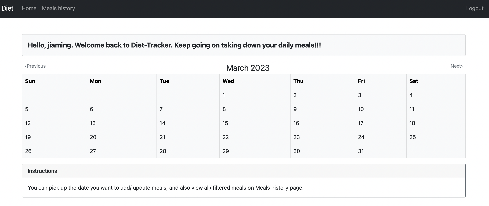
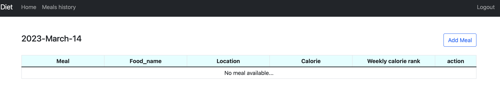
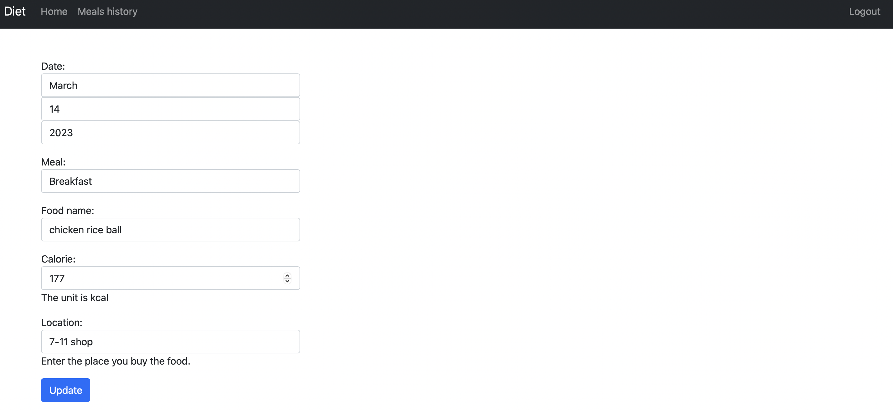

# Diet-tracker
    
This repository shows the creation of Diet-tracker Web API using the Django web framework.
## Description
Diet-tracker aims to help take down daily meals details including where to buy it and how much calorie it contains and also retrospect what have been eaten.
The Diet-tracker is built on class-based views of Django for easier maintenance and extension purposes. The web pages of it are constructed using HTML, CSS and Bootstrap 5 with additional datepicker function provided by jQuery. More, Postgresql is seleceted to manage the meals records.

## Screenshots
The following screenshots demostrate how Diet-tracker works.

### Login/ Sign up
Upon you accessing the page, you will see the figure below.
Log in with your account, if you have an account already, else, click the "Sign up" link on the upper right corner. Soon after you signing up, the page will redirect to the home page where there is a calendar in the middle.

&#8595; Login page 
  
&#8595; Sign up page 

### Add/ Update the meal
At the home page, you can choose the date you want to add/ apdate the meal record.

Pick one date 
&#8595; home page 
 

Click the add button 
&#8595; meal list by day 

Take down the meal detail 
&#8595; add meal page 
 

After adding the meal 
&#8595; after adding 
 

Go back to revise the meal detail 
&#8595; Update meal page 
 

Or, delete specific meal 
&#8595; Delete meal confirmation page 
 

### View all meals
You can also view the meal history at the Meals history page. 

&#8595; meals-history page 

